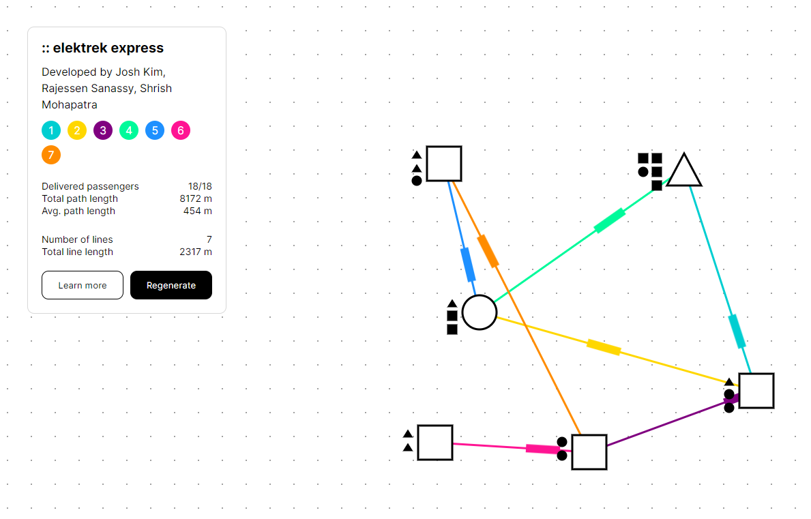

# elektrek express




> Using neural networks to create optimal transportation networks. Developed by Josh Kim, Rajessen Sanassy, and Shrish Mohapatra.

## Overview
The objective of the project is to create optimal design of subway lines by using a neural network trained with a [genetic algorithm](https://en.wikipedia.org/wiki/Genetic_algorithm).

The aim is to create a subway network that is efficient and maximizes passenger flow, while minimizing the number of lines used and total path cost. The project will involve generating sample data for passenger location frequency and station configurations, then using this data as input for the genetic neural network. The network will be trained to generate optimal subway lines that can deliver the maximum number of passengers while minimizing the number of missed passengers and total path cost.

The project has the potential to improve the efficiency and convenience of public transportation systems, making them more attractive and accessible to commuters.

## Running Application
```bash
# Setup backend ---
cd backend
pip install -r requirements.txt
flask run

# Setup frontend ---
# Create a new terminal shell for this
cd frontend
npm i
npm run dev
```

Navigate to the URL specified in the terminal to access the React application. Click generate to observe as the model attempts to generate lines which optimize passenger flow.

## Learn More
This project was developed for an introductory neural networks course at Carleton University. See this brief [report](elektrek-express_report.pdf) for more information on the project